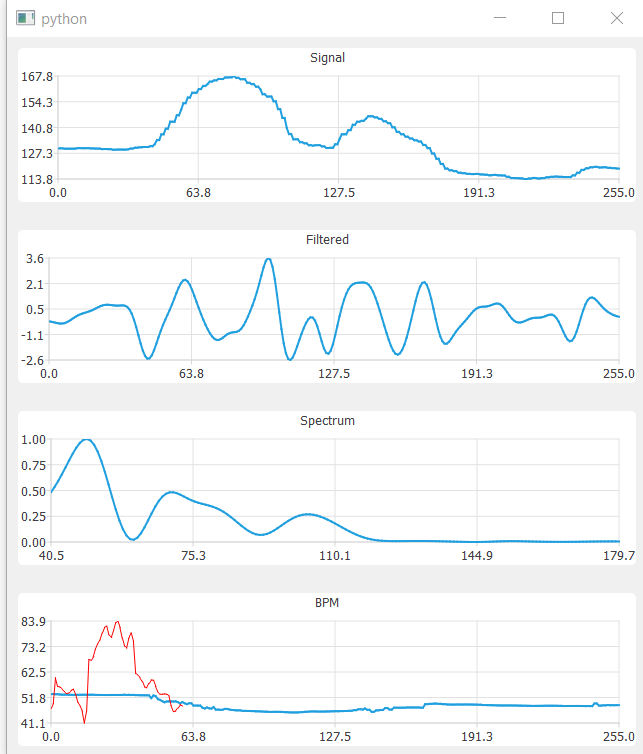

|PyVersion| |Status| |PyPiVersion| |License|

Introduction
------------

Face detection and tracking are used to observe the tiny variations
in skin tone that result from the increased blood flow after a heart beat.
By averaging, filtering and Fourier-transforming these variations the heart
rate is estimated and graphed.

Multiple persons in the scene are analysed simultaneously.

Installation
------------

::

    pip install setup.py

Usage
-----

::

    heartwave [optional filename, URL or camera ID]

When the window is open, wait until the window displays your webcam. 
If you have more than 1 webcam, you can specify them in the 
`Source -> Webcam` menu or in the command above. 

You can also use a video file or video streaming URL as the input by 
specifying them in the command above or via the `Source` menu.

Example Output
--------------

Links
-----

    * `webcam-pulse-detector <https://github.com/thearn/webcam-pulse-detector>`_
    * `The enigma of Mayer waves <https://academic.oup.com/cardiovascres/article/70/1/12/408540>`_
    * `Remote Detection of Photoplethysmographic Systolic and Diastolic Peaks Using a Digital Camera <https://www.media.mit.edu/publications/remote-detection-of-photoplethysmographic-systolic-and-diastolic-peaks-using-a-digital-camera>`_
    * `Measuring heart rate with a smartphone camera <http://www.ignaciomellado.es/blog/Measuring-heart-rate-with-a-smartphone-camera>`_

.. |PyPiVersion| image:: https://img.shields.io/pypi/v/heartwave.svg
   :alt: PyPi
   :target: https://pypi.python.org/pypi/heartwave

.. |PyVersion| image:: https://img.shields.io/badge/python-3.6+-blue.svg
   :alt:

.. |Status| image:: https://img.shields.io/badge/status-beta-green.svg
   :alt:

.. |License| image:: https://img.shields.io/badge/license-BSD-blue.svg
   :alt:
